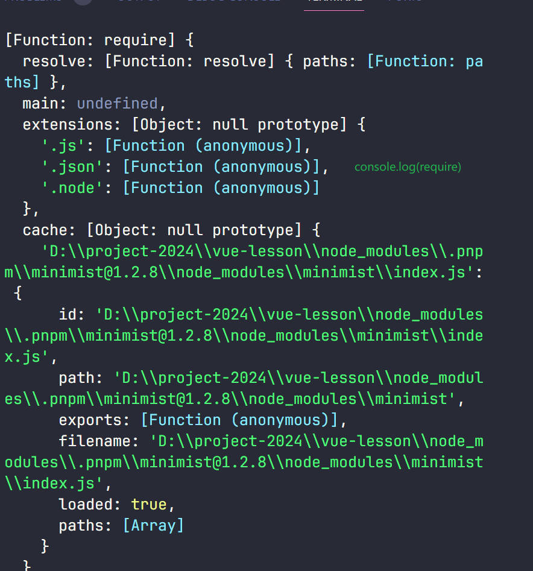

`shamefully-hoist=true`使`node_modules`扁平
化

minimist
拿到命令行参数

esbuild

`fileURLToPath`获取命令行参数-查看当前文件目录（绝对路径）

`__filename`获取文件路径（绝对路径）
`__dirname`获取文件目录（绝对路径）  

打印的`require`
  
访问 require 的属性

### 访问 `require` 的属性

1. **`require.cache`**:
   ```javascript
   console.log(require.cache);
   ```
   输出一个对象，包含所有已加载的模块及其路径。

2. **`require.extensions`**:
   ```javascript
   console.log(require.extensions);
   ```
   输出一个对象，包含不同文件扩展名及其对应的处理函数。注意：不推荐修改 `require.extensions`，因为这可能导致代码无法在不同版本的 Node.js 上运行。

3. **`require.main`**:
   ```javascript
   if (require.main === module) {
       console.log('This script is the main module.');
   }
   ```

`esm-bundler`: `import`
`esm-browser`: `<script src>`
`cjs`: `require` `module.export`  

`Object.prototype.toString.call()`比typeof更准确
```js
console.log(Object.prototype.toString.call("hello")); // [object String]
console.log(Object.prototype.toString.call(123)); // [object Number]
console.log(Object.prototype.toString.call(true)); // [object Boolean]
console.log(Object.prototype.toString.call([])); // [object Array]
console.log(Object.prototype.toString.call({})); // [object Object]
console.log(Object.prototype.toString.call(function() {})); // [object Function]
console.log(Object.prototype.toString.call(new Date())); // [object Date]
console.log(Object.prototype.toString.call(null)); // [object Null]
console.log(Object.prototype.toString.call(undefined)); // [object Undefined]
```

```bash
pnpm install @vue/shared --workspace --filter @vue/reactivity
```
加上--workspace，在本地仓库中安装依赖